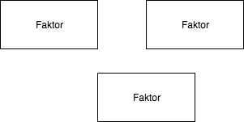

# rstudiotest
Hallo das ist eine Projektbeschreibung.

Diese Beschreibung ist in Markdown verfasst. Aller Inhalt ist in der _Progammiersprache_ `r` erstellt.

Man kann sogar mit Windows arbeiten. Die Installation von Git ging ganz einfach, man muss nur sehr oft auf `ok` klicken.

## Überschriften
Das ist auch ein Text
 das ist kein Text
### Unterüberschrift

* Liste 1
* Liste 2

1. Liste 1
2. Liste 2

| Hallo | Test |
|------|-------|
| Hallo | Test |
